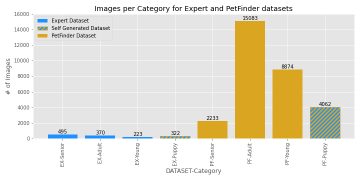
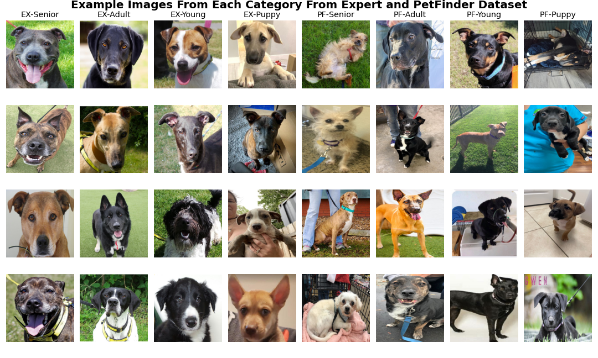
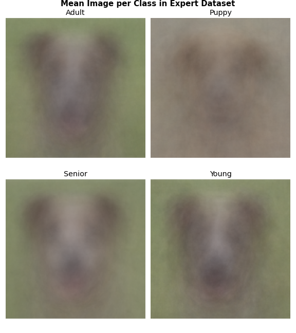
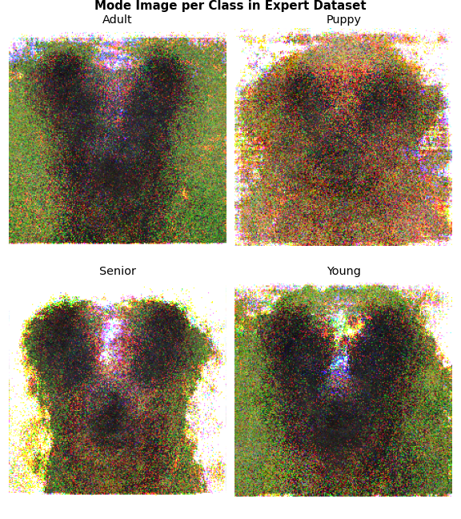
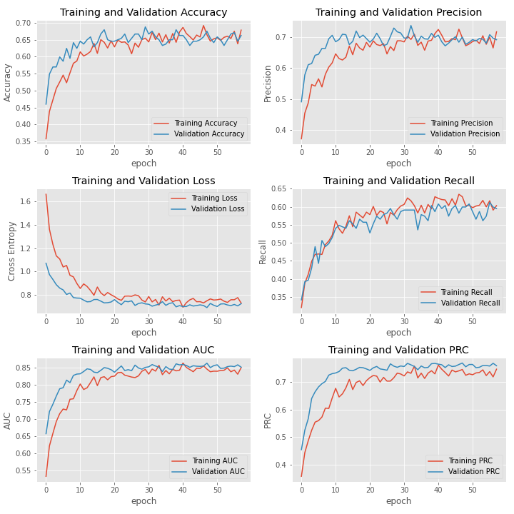
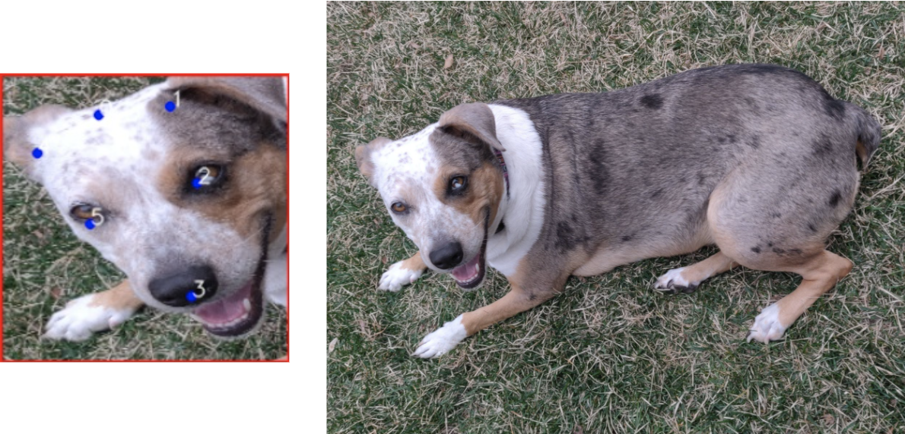
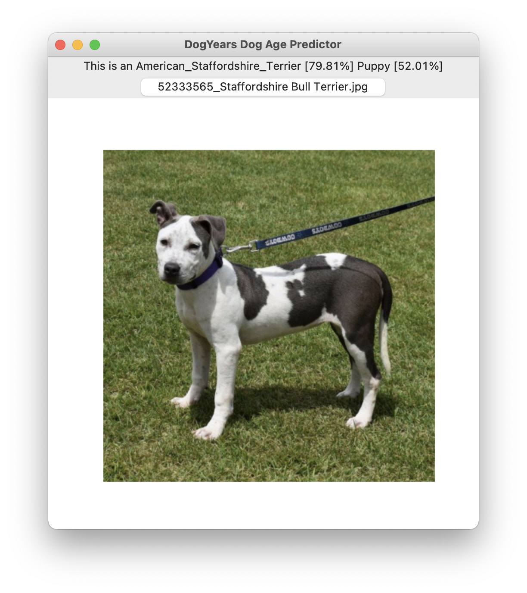
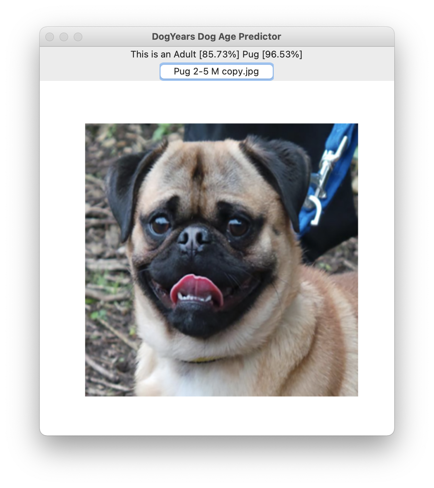
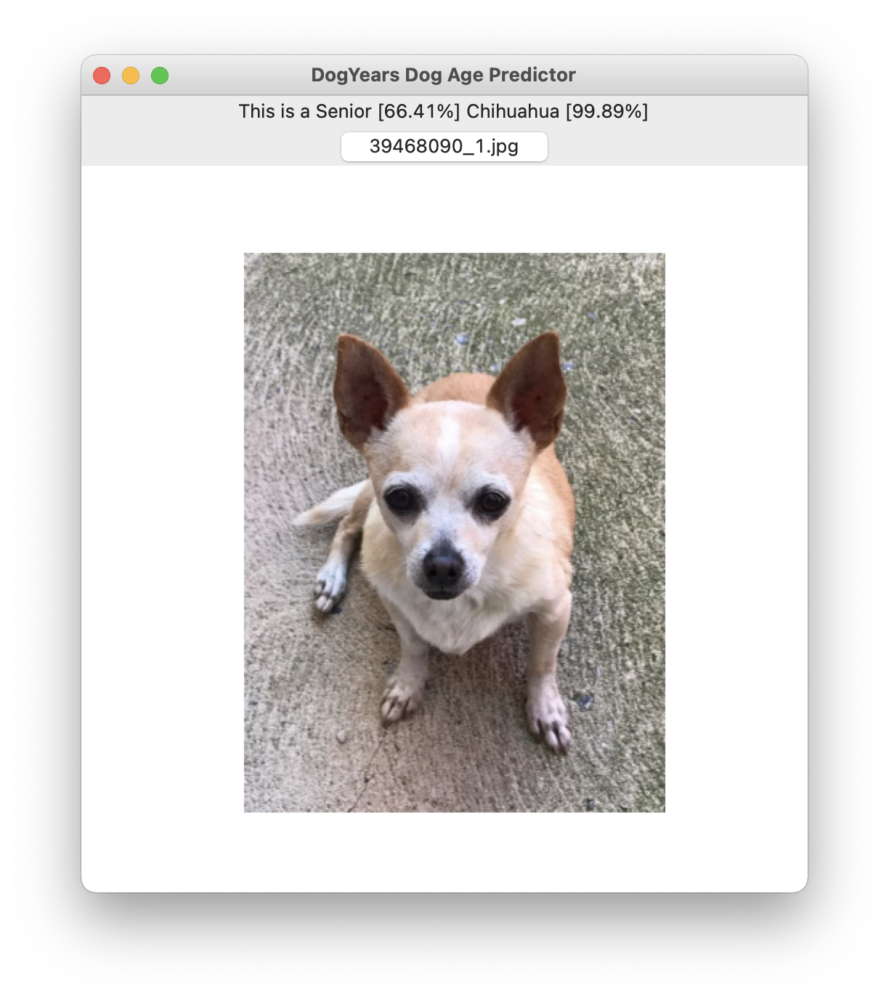

# Dog-Years-Age-Classification

## Introduction
Machine learning algorithms have made great progress in identifying age progression in humans, but for dogs little work has been done. I came across the
[DogAge Dataset](https://www.researchgate.net/publication/335699398_Automatic_Estimation_of_Dog_Age_The_DogAge_Dataset_and_Challenge), a rarely attempted multi-class categorical dataset containing images of dogs broken into 3 categories: Adult, Young, and Senior. 

### Use Case
This classification of dogs based on age could potentially be implemented by pet adoption sites and agencies to help categorize or correctly recategorize dogs based on their ages.

## Dataset
The original dataset contained two separate dataset each categorized into 3 classes: Young (0 −2 years), Adult (2 −5 years), and Senior (>6 years). Per the dataset documentation they are:

1. Expert data: contains 1373 images collected by animal scientists, sampling pet dogs, shelter dogs, laboratory dogs, working dogs and commercial kennel dogs. Their age and division into the three groups was carefully verified. The images are mostly high-quality portraits with the dog facing upwards forward.

2. Petfinder data: contains 26190 images collected using the APIs of Petfinder, a portal for pet adoption. The division of dogs into groups is not verified, and there is a diversity of angles and distances of the photos. The raw data has been cleaned, removing photos with more than one dog, containing other pets or large parts of humans, with a resolution less then 500 px on any dimension, and signboard photos.

Working with these datasets initial models had an especially difficult time distinguishing between the young and adult classes. For the sake of creating a minimum viable product, I dropped the young class and generated a class of puppy images using the PetFinder API. Using [Puppy Images Script](src/get_puppy_imgs.py), I collected approximately 5000 puppy photos, from which I removed obvious errors (e.g. imgs that said "photo to be added"), images containing other dogs/pets/humans, and collage images. I also attempted to remove a selection of puppy images that followed the layout of the Expert Dataset. This resulted in including a new puppy class into each dataset 322 puppy images into the Expert dataset and 4062 into the PetFinder dataset.

## EDA
Looking at all the data it is very clear that the classes are imbalanced, especially for the PetFinder Dataset. When working with the data it will be important to consider the imbalance and account for it in the model.

Below is example images randomly selected from each class of each dataset. It is very clear the difference in uniformity of the images between the consistent Expert dataset and the more random PetFinder Dataset

Next I took all the images from each class in the Expert Dataset and converted them into a stack of 1D numpy arrays. Using this information I calculated the mean median and mode of each pixel value and plotted them to gain insights into generalized similarities and difference between the classes.

These composite images show how consistent the 3 original categories of the Expert dataset are. Each showing a similar composite dog face on a green background, as opposed to the self-generated puppy class that had more diversity in background and head alignment. This to will need to be accounted for in when using the data to create models.

## Modeling
After attempting to build a CNN model from scratch and multiple pretrained models, and comparing performance, I settled on MobileNetV2. From the output of MobileNetV2 I next added a Global Average Pooling 2D layer into a 0.75 Dropout layer and finally into a Dense layer of 3 with softmax activation. I used the Adam optimizer with a learning rate of 0.001 and Categorical Cross Entropy as the loss metric.

Baseline (Scratch CNN):
- Categorical Cross Entropy: 0.925
- Categorical Accuracy: 0.459

Final (MobileNetV2 + Output Layers):
- Categorical Cross Entropy: 0.807
- Categorical Accuracy: 0.623

### Dataset Class Imbalance
As seen in the EDA the datasets especially the PetFinder dataset had major class imbalance. I attempted to remedy this by calculating and including class weights for each class. When working with the PetFinder dataset adding the weight parameters helped to improve performance. But when working with the relatively less imbalanced Expert dataset including the class weights actually decreased performance.

### Dog Facial Recognition
To attempt to improve the quality and uniformity of data input into the model, I decided focusing on the face of each dog. To do this I used the dlib C++ library's Face Detection CNN model with a precompiled dataset of dog faces to detect the faces and features of each dog. When working with just the Expert dataset inputting just the dog faces into the model reduced the variance of the model but also reduced performance.

### Breed Recognition
To add functionally to the application I wanted to have the app predict the breed of the input dog image. To do this I used the popular Stanford Dog Dataset and a MobileNetV2 based model to achieve 77% categorical accuracy with 96% top k accuracy on the validation set.

## Application
To display the results of the trained models, I created a small GUI application using the Tkinter python library.

The app allows the user to input an image file of a dog, the app the displays the image and outputs the predicted age and breed of the dog.

